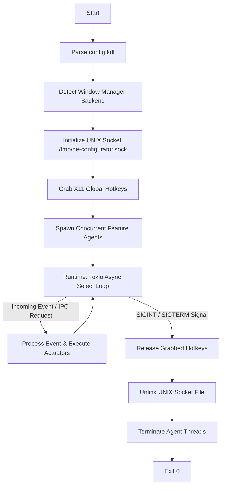

# System Overview

`de-configurator` is a lightweight, low-footprint background daemon designed to manage desktop environment configurations on Linux. It operates autonomously in user-space, requiring no root privileges and utilizing minimal CPU and memory resources. 

- **Footprint & Memory Efficiency**: Built with Rust (Edition 2024) and utilizing the `mimalloc` allocator to minimize heap fragmentation and overhead. 
- **Operation Mode**: Operates in a hybrid reactive, event-driven mode. It remains idle in a Tokio-driven select loop until woke by hardware interrupts (global hotkeys), Window Manager events (via sockets), or local IPC commands (via UNIX Domain Sockets).

---

# Process Lifecycle

The execution lifecycle of the daemon is split into three main phases: initialization, the runtime event loop, and graceful shutdown.

### 1. Initialization
- **Configuration Parsing**: Reads the structured `config.kdl` file from local configuration directories, checking features activation state.
- **Environment Detection**: Evaluates environment variables (e.g., `HYPRLAND_INSTANCE_SIGNATURE`) to automatically configure the window manager driver (`bspwm` vs `hyprland`).
- **IPC Initialization**: Binds to a local UNIX Domain Socket (`/tmp/de-configurator.sock`) to allow CLI execution requests from the `de-action` utility.
- **Hotkey Grabbing**: Interfaces with the X11 connection using `global-hotkey` to grab registered key combinations globally at the XServer level.
- **Agent Spawning**: Launches asynchronous concurrent loops for each enabled feature (VPN, Daemons, Workspaces, Actions, Triggers) on the Tokio runtime.

### 2. Main Loop (Runtime)
The main daemon thread runs an asynchronous event-driven loop using `tokio::select!`. It sleeps until one of the following events occurs:
- A registered hotkey is pressed (producing an event in the `GlobalHotKeyEvent` channel).
- A message is received on the local Unix Domain Socket from a CLI client.
- The window manager listener detects window focus, creation, or workspace switching.
- An internal timer tick fires (e.g., periodic VPN status checks).

### 3. Graceful Shutdown
Upon receiving a termination signal, the daemon triggers its teardown workflow:
- Unregisters all hotkeys from the window server to restore default keyboard behavior.
- Closes and deletes (unlinks) `/tmp/de-configurator.sock` to prevent lock/socket leaks.
- Signals background tasks and threads to stop.
- Flushes mimalloc heaps and terminates the process with exit code `0`.

---

# OS Signals Handling

The daemon monitors operating system signals to manage its state and process lifecycle:

- **`SIGINT` / `SIGTERM`**: Triggers the graceful shutdown sequence. The daemon halts event processing, unbinds the Unix socket, unregisters hotkeys, and exits cleanly.
- **`SIGHUP`**: Instructs the daemon to reload its configuration. It parses `config.kdl` again and dynamically re-initializes keybindings and daemon configurations without restarting the core process.

---

# State & Resource Management

The daemon manages its runtime state and system resources using local, low-latency mechanisms:

- **Memory Safety**: Guaranteed by Rust’s compile-time borrow checker, eliminating double-frees and data races. `mimalloc` replaces the standard allocator to ensure fast, predictable allocations.
- **Runtime State Cache**: The `StateStore` module holds the current status of features (e.g., active VPN, running daemons) in-memory, avoiding disk I/O bottlenecks.
- **Locking & IPC File**: The UNIX Domain Socket file at `/tmp/de-configurator.sock` acts as a natural single-instance lock. If the file is already bound and the socket is active, a second daemon instance will fail to bind and exit immediately.

---

# Logging & Observability

Observability and health monitoring of the daemon rely on system-standard logging output:

- **Log Destinations**: Outputs structured text messages to `stdout` and `stderr`. When running as a `systemd --user` service, these streams are captured and indexed by `journald`.
- **Log Structure**: Contains timestamps, module identifiers (e.g., `workspaces`, `bspwm`, `vpn`), event names, and execution results.
- **Log Levels**: 
  - `INFO`: Normal operations (e.g., starting features, successful workspace transitions).
  - `DEBUG`: Verbose tracing (e.g., matching parsed key codes, individual WM events).
  - `WARNING` / `ERROR`: Component failures (e.g., failed command executions, keybind registration errors).

---

# Error Handling & Recovery

To maintain high availability in the user's desktop environment, the daemon uses a fail-soft fault tolerance model:

- **Component Isolation**: Fatal errors in individual agents (like a VPN CLI utility returning an error code, or a workspace window fail-to-move) do not crash the core daemon. They are translated into error events, logged, and the daemon continues running.
- **Subprocess Supervision**: The Daemons Agent monitors external processes spawned by it (like `picom` or `dunst`). If a managed background process dies, the agent can attempt to restart it.
- **System-level Supervisor**: The daemon is intended to run as a user service under `systemd` or `launchd` with a restart policy (`Restart=on-failure`, `RestartSec=3s`) to handle unexpected panics or X11 connection failures.
